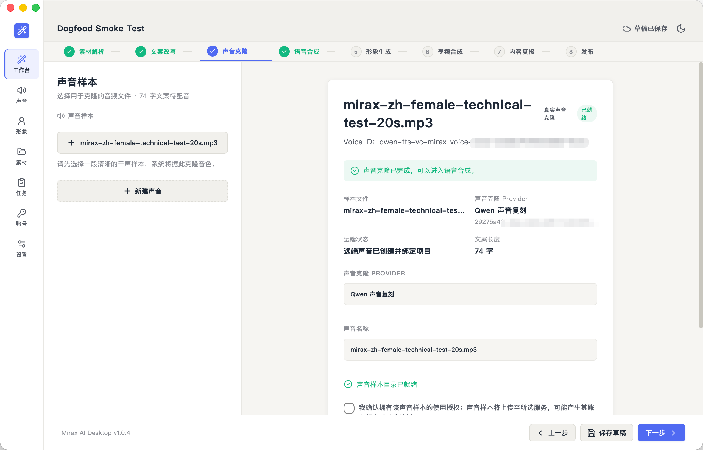
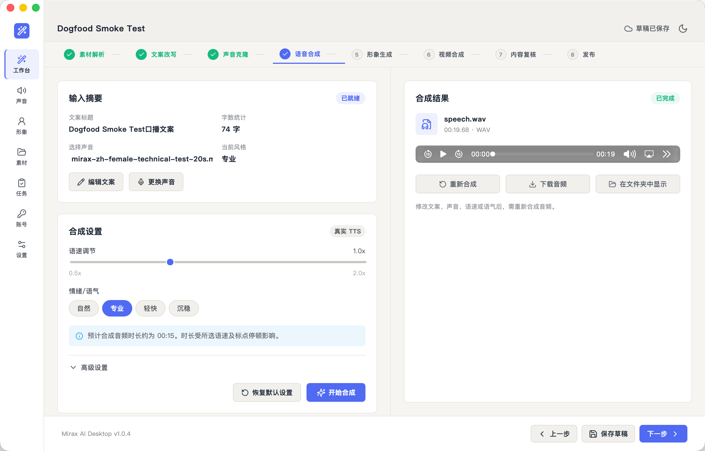
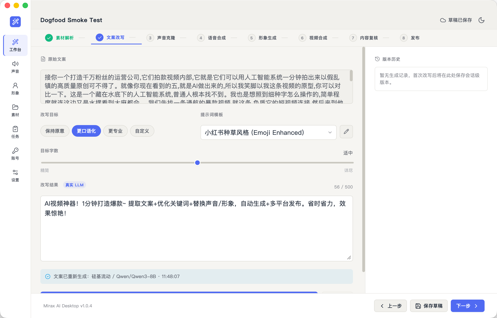

# Mirax AI

Mirax AI 是一个面向短视频创作流程的桌面端实验项目，目标是把「素材解析 → 文案改写 → 声音/数字人生成 → 视频合成 → 发布准备」串成一个本地优先的工作台。

> 当前是 dogfood 版本。素材转写、文案改写、百炼 Qwen 声音复刻与语音合成已形成可运行的真实链路；数字人、完整视频合成和真实发布仍在开发中。

## 当前状态

已可用：

- 桌面端 Workbench 8 阶段 UI。
- 设置页、AI 服务、本地依赖、输出与存储等基础界面。
- SQLite 本地持久化，包括工作台草稿、Provider 配置与密钥、声音样本目录、样本记录、项目声音绑定和语音产物恢复。
- 非敏感设置保留浏览器快照兼容；API Key、声音样本根目录 ID、样本绝对路径和远端 Voice ID 不进入 browser snapshot。
- 文案改写真实 LLM 调用，可显式选择当前用于文案改写的 Provider。
- FFmpeg 本地检测与视频音频抽取。
- OpenAI `whisper-1` 文件上传转写链路。
- 本地 Whisper / faster-whisper 转写，默认使用 `tiny`、CPU、int8 做本机 ASR。
- 本地视频 → FFmpeg 音频抽取 → 转写 → 文案改写 dogfood 链路。
- 用户选择声音样本存储目录后，将授权样本复制到受管目录；原文件不移动，样本路径不会写入草稿或浏览器存储。
- 百炼 Qwen-TTS 中文声音复刻：本地受管样本 → Voice ID → 项目 active clone，已使用真实百炼配置完成 dogfood。
- 百炼 Qwen-TTS 语音合成：签名结果由 Tauri 原生网络层下载到受限本地音频目录，已完成真实合成、落盘和播放验证。
- ElevenLabs 普通 TTS 接入（Workbench 第 4 阶段），输出 MP3，通过 ffprobe 读取时长。
- 语音结果页支持播放、重新合成、原生另存为和在 Finder / 文件管理器中定位产物。
- 草稿恢复，包括稳定项目 ID、素材、文案、工作流状态和本地语音产物；应用重启后可恢复项目声音绑定。

仍未完成：

- 百炼 CosyVoice 手工 OSS URL 路径的真实 dogfood；代码已接入，但尚未完成远端验收。
- OSS 自动上传、STS 临时凭证、短效签名 URL 和对象清理。
- ElevenLabs Instant Voice Cloning 的真实验收；代码已接入，但需要包含该能力的付费订阅。
- 语速、情绪、音调和停顿参数尚未接入当前真实 TTS Provider，请勿据此判断合成效果。
- 数字人生成的真实能力。
- 视频合成完整验收。
- 内容复核、发布任务、账号管理的真实平台接入。
- OAuth、平台发布 API、发布状态回传。

百炼 Qwen 声音复刻与语音合成已完成真实 dogfood，但不代表 CosyVoice、ElevenLabs 商用许可、数字人、完整视频合成或发布已完成。

## Screenshots

> 以下截图包含早期 dogfood 界面，功能说明以本文“当前状态”为准。下一轮建议替换 `workbench.png` 和 `ai-services.png`，并补充声音样本存储目录页截图。

### Workbench


### 声音克隆



### 语音合成



### 本地转写与文案改写



### AI 服务


### 本地依赖


## 技术栈

- Tauri 2
- Vue 3
- TypeScript
- Rust
- SQLite
- pnpm workspace
- Vitest
- FFmpeg

## 项目结构

```text
apps/
  desktop/          Tauri 桌面端应用
packages/
  core/             领域类型、工作流、校验
  local-store/      SQLite schema 与仓储
  media-pipeline/   FFmpeg 命令构建
  provider-ai/      AI Provider 适配
docs/
  codex/            Codex 活动项目状态、后续计划与迁移设计
  superpowers/      历史计划与设计档案
  product-architecture/
  reverse-engineering/
```

## 本地运行

需要先安装：

- Node.js
- pnpm
- Rust
- FFmpeg

安装依赖：

```bash
pnpm install
```

启动桌面端：

```bash
pnpm --filter @mirax/desktop dev
```

仅启动 Web 调试界面：

```bash
pnpm --filter @mirax/desktop dev:web
```

常用检查：

```bash
pnpm test
pnpm typecheck
pnpm --filter @mirax/desktop build:web
```

Tauri 侧检查：

```bash
cd apps/desktop/src-tauri
cargo check
```

## 配置

### FFmpeg

进入 `设置 → 本地依赖`，点击 `检测本地环境`。如果 FFmpeg 在当前进程的 `PATH` 中，会自动填入路径并标记为已就绪。

### 文案改写 Provider

进入 `设置 → AI 服务`，添加 OpenAI 兼容 Provider，例如 OpenAI、DeepSeek、硅基流动或自定义接口。测试连接用于主动检查配置；Provider 配置就绪后可点击 `设为文案改写`，工作台会直接使用当前选中的文案改写 Provider。

### 声音样本、百炼 Qwen 声音复刻与语音合成

当前已经人工验证的最短真实链路：

1. 进入 `设置 → 输出与存储`，选择“声音样本存储目录”。该目录记录只保存在本地 SQLite。
2. 进入 `设置 → AI 服务`，添加 **百炼 Qwen-TTS 声音复刻** Provider。
3. 填写百炼 API Key、业务空间 Base URL（`https://<业务空间ID>.cn-beijing.maas.aliyuncs.com/api/v1`），模型选择 `qwen3-tts-vc-2026-01-22` 并启用。
4. 在 Workbench 第 3 阶段选择 10–20 秒、背景干净的中文人声样本，填写声音名称并确认拥有使用授权，然后开始克隆。
5. 克隆完成后页面会显示项目绑定的 Voice ID；进入第 4 阶段即可使用同一个项目声音进行真实语音合成。
6. 合成结果会写入配置的本地音频输出目录，可在页面播放、重新合成、另存为或在 Finder / 文件管理器中定位。

安全边界：

- 声音样本必须来自本人或已获得明确授权的声音。
- API Key 只写入 SQLite `provider_secrets`；不会进入草稿、browser snapshot、localStorage 或普通日志。
- 原始样本文件不会被移动；应用复制一份到用户选择的受管目录。
- 样本绝对路径、百炼临时签名 URL 和完整远端响应不会写入草稿或浏览器存储。
- Qwen 合成返回的临时结果 URL 只允许百炼 DashScope 专用 OSS 主机名，并由受限 Tauri 原生命令下载。

百炼 CosyVoice 也已完成代码接入，但第一版要求用户手工把同一份样本上传到 OSS，并在当前克隆会话中粘贴短期 HTTPS 签名 URL；该路径尚未完成真实 dogfood。

### ElevenLabs TTS（普通文本转语音）

进入 `设置 → AI 服务`，添加类型为 **ElevenLabs TTS** 的 Provider：

- API Key：ElevenLabs API Key，与现有 provider 一样保存在本地 SQLite `provider_secrets`，不会进入 snapshot、localStorage、日志或测试 fixture。
- Voice ID：默认 `pNInz6obpgDQGcFmaJgB`，可在 ElevenLabs 声音库中选择其它 Voice ID。
- Model：固定选项 `eleven_multilingual_v2`，默认即该模型。
- Base URL：ElevenLabs 官方 API，无需填写。

配置完整并启用后，Workbench 第 4 阶段「语音合成」可直接点击生成语音，**不需要先通过连接测试**。产物为 `speech.mp3`，生成成功后通过 `ffprobe` 读取时长。需要在 `设置 → 本地依赖` 中配置并验证 FFmpeg 路径，以便 `ffprobe` 探测音频时长。

ElevenLabs Instant Voice Cloning 的项目绑定、样本管理和错误诊断代码也已接入，但真实克隆要求账号订阅包含该能力。普通 TTS 与声音克隆的计费和授权范围不同，使用前请检查 ElevenLabs 当前套餐及声音授权要求。

### 语音转写

当前真实转写支持两条路径。

#### OpenAI whisper-1

- Base URL: `https://api.openai.com/v1`
- Model: `whisper-1`
- 需要 API Key

OpenAI `whisper-1` API 不是免费能力。

#### 本地 Whisper / faster-whisper

- 默认 Python: `~/.local/share/mirax-ai/asr-venv/bin/python`（Rust 侧会展开 `~` 到用户 `HOME`）
- 默认 Model: `tiny`（可改为 `base` 等）
- 默认 Device: `cpu`
- 默认 Compute Type: `int8`
- 可在 Provider 配置中覆盖 Python 解释器路径，连接测试与真实转写使用同一路径

模型取舍（本机 dogfood 实测，60 秒素材）：

- `tiny`：转写约 3.5 秒，速度很快，但中文繁体残留和错词/漏词较多，适合快速 dogfood。
- `base`：中文质量明显更好、基本简体，但 CPU 上约 5× 实时（约 5 分钟），风扇明显加速，适合短素材或离线验收。

因此默认保持 `tiny`；需要更好中文质量时，可在设置页把模型手动改为 `base`。

本地视频会先通过 FFmpeg 抽取音频，再交给 faster-whisper 转写。当前 dogfood 已验证本地视频 → 本地转写 → 文案改写链路。

## 开发口径

这个仓库目前遵守一个简单原则：**不要把 mock 写成真实能力**。

如果某个页面或阶段还没有真实后端能力，UI 应明确显示 mock、未连接或未就绪状态。真实能力按链路逐步接入：

1. 素材解析 / 语音转写
2. 文案生成与改写
3. 语音合成 / 声音克隆
4. 数字人生成
5. 视频合成
6. 内容复核
7. 账号与发布

当前详细进度见：

- `docs/codex/PROJECT-STATE.md`

## 安全说明

- API Key、token 等敏感信息不应写入日志、普通 snapshot 或任务 payload。
- 本地数据库和草稿用于开发 dogfood，不代表最终安全模型。
- 开源前请自行检查 `.env`、数据库、截图和本地素材，避免误提交敏感内容。

## License

MIT License. See [LICENSE](./LICENSE).
