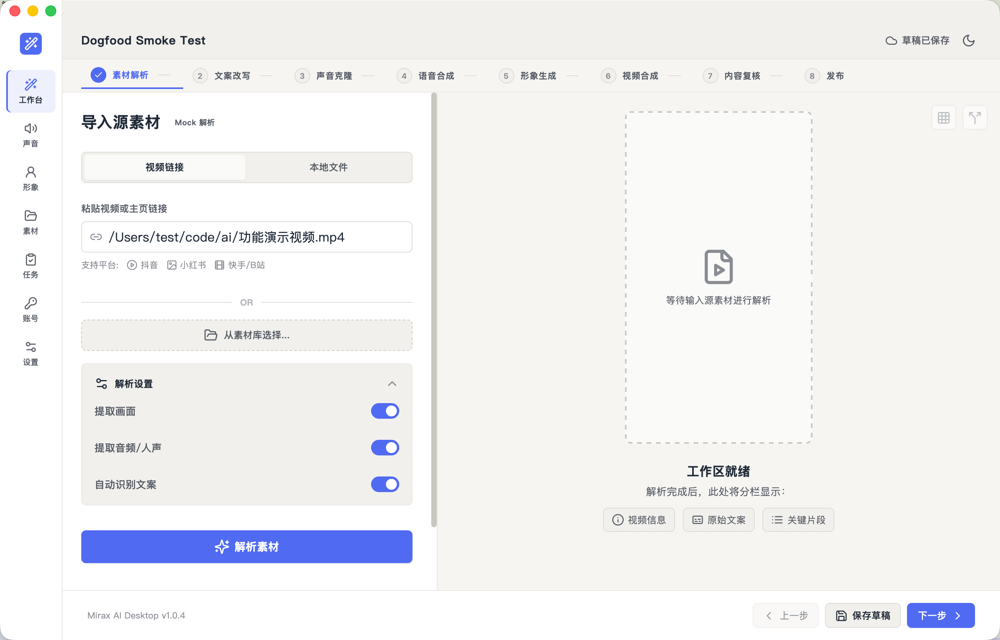
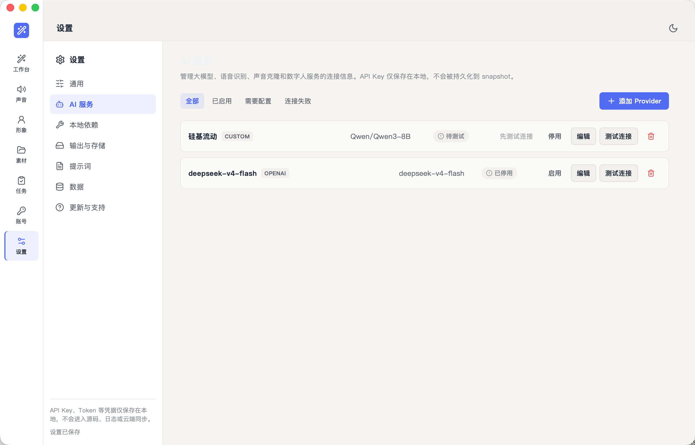
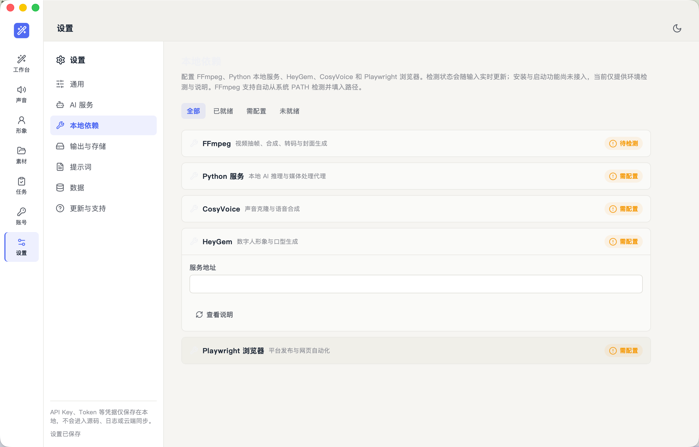

# Mirax AI

Mirax AI 是一个面向短视频创作流程的桌面端实验项目，目标是把「素材解析 → 文案改写 → 声音/数字人生成 → 视频合成 → 发布准备」串成一个本地优先的工作台。

> 当前是半成品 / dogfood 版本。UI 主流程已基本完成，部分 AI 能力已接入真实调用，其余创作和发布能力仍是 mock 或占位状态。

## 当前状态

已可用：

- 桌面端 Workbench 8 阶段 UI。
- 设置页、AI 服务、本地依赖、输出与存储等基础界面。
- Provider 配置与本地持久化，SQLite 优先，localStorage fallback。
- 文案改写真实 LLM 调用，可显式选择当前用于文案改写的 Provider。
- FFmpeg 本地检测与视频音频抽取。
- OpenAI `whisper-1` 文件上传转写链路。
- 草稿恢复，包括素材路径、文案改写目标、模板和目标字数。

仍未完成：

- 本地 Whisper / faster-whisper 转写。
- 声音克隆、语音合成、数字人生成的真实能力。
- 视频合成完整验收。
- 内容复核、发布任务、账号管理的真实平台接入。
- OAuth、平台发布 API、发布状态回传。

## Screenshots

### Workbench



### AI 服务



### 本地依赖



## 技术栈

- Tauri 2
- Vue 3
- TypeScript
- Rust
- SQLite
- pnpm workspace
- Vitest
- FFmpeg

## 项目结构

```text
apps/
  desktop/          Tauri 桌面端应用
packages/
  core/             领域类型、工作流、校验
  local-store/      SQLite schema 与仓储
  media-pipeline/   FFmpeg 命令构建
  provider-ai/      AI Provider 适配
docs/
  superpowers/      项目状态、计划与实现记录
  product-architecture/
  reverse-engineering/
```

## 本地运行

需要先安装：

- Node.js
- pnpm
- Rust
- FFmpeg

安装依赖：

```bash
pnpm install
```

启动桌面端：

```bash
pnpm --filter @mirax/desktop dev
```

仅启动 Web 调试界面：

```bash
pnpm --filter @mirax/desktop dev:web
```

常用检查：

```bash
pnpm test
pnpm typecheck
pnpm --filter @mirax/desktop build:web
```

Tauri 侧检查：

```bash
cd apps/desktop/src-tauri
cargo check
```

## 配置

### FFmpeg

进入 `设置 → 本地依赖`，点击 `检测本地环境`。如果 FFmpeg 在当前进程的 `PATH` 中，会自动填入路径并标记为已就绪。

### 文案改写 Provider

进入 `设置 → AI 服务`，添加 OpenAI 兼容 Provider，例如 OpenAI、DeepSeek、硅基流动或自定义接口。测试连接通过后，点击 `设为文案改写`。

### 语音转写

当前真实转写只接了 OpenAI Audio Transcriptions：

- Base URL: `https://api.openai.com/v1`
- Model: `whisper-1`
- 需要 API Key

OpenAI `whisper-1` API 不是免费能力。本地 Whisper / faster-whisper 尚未接入。

## 开发口径

这个仓库目前遵守一个简单原则：**不要把 mock 写成真实能力**。

如果某个页面或阶段还没有真实后端能力，UI 应明确显示 mock、未连接或未就绪状态。真实能力按链路逐步接入：

1. 素材解析 / 语音转写
2. 文案生成与改写
3. 语音合成 / 声音克隆
4. 数字人生成
5. 视频合成
6. 内容复核
7. 账号与发布

当前详细进度见：

- `docs/superpowers/PROJECT-STATE.md`

## 安全说明

- API Key、token 等敏感信息不应写入日志、普通 snapshot 或任务 payload。
- 本地数据库和草稿用于开发 dogfood，不代表最终安全模型。
- 开源前请自行检查 `.env`、数据库、截图和本地素材，避免误提交敏感内容。

## License

MIT License. See [LICENSE](./LICENSE).
